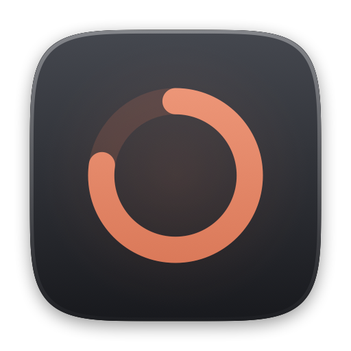
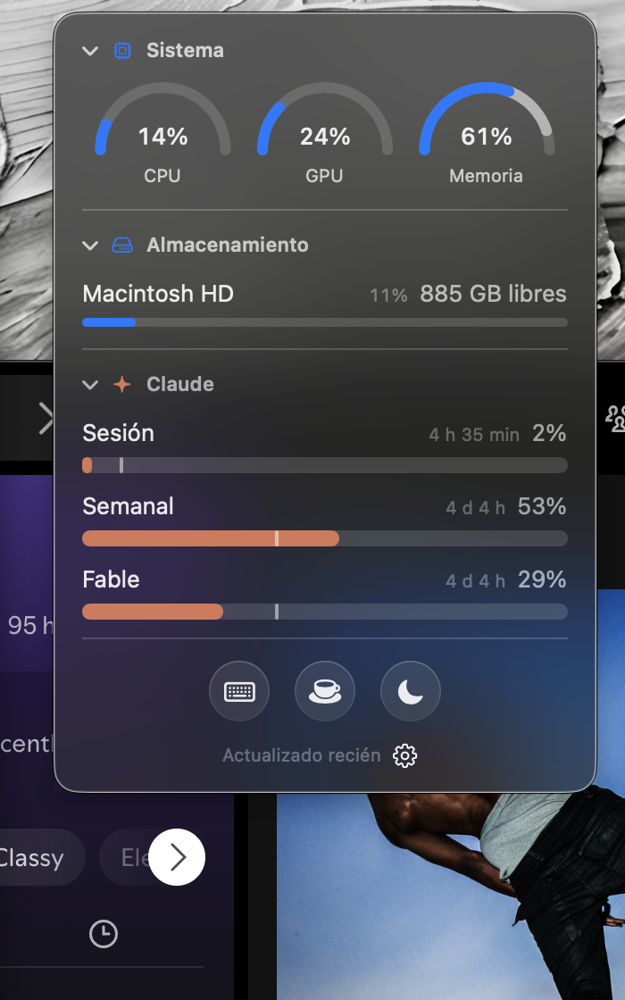

<div align="center">



# Vitals

**A native macOS menu bar app for your Mac's vitals and your *real* Claude usage limits.**

Built entirely without opening Xcode. No dependencies. ~45 MB of memory, 0% CPU at rest.



</div>

---

## What it does

The menu bar icon is a ring that fills as you burn your Claude **5-hour session**. Empty ring, fresh session. Full ring, you're done until it resets.


Click it and you get:

- **System** — CPU, GPU and memory as arc gauges. The memory arc has a second, neutral segment for cached files: macOS keeps them for speed and releases them the moment anything needs the RAM, so they shouldn't count as "used".
- **Storage** — free space per volume.
- **Claude** — your three real limits: the 5-hour session, the weekly cap, and the weekly cap for the specific model. Each with a **pace mark**.
- **Three actions** — lock the keyboard to clean it, keep the Mac awake, or turn the screen off while your agents keep running.

## Install

Only needs Xcode **Command Line Tools** — `xcode-select --install`. Not Xcode itself.

```sh
git clone https://github.com/crizoz/vitals.git
cd vitals
./build.sh --install
```

That compiles it, signs it, drops it in `/Applications` and launches it. There's a "Open at login" toggle in the gear menu.

macOS will ask **once** for permission to read the Claude Code credentials from your Keychain. Choose **Always Allow**.

---

## The parts worth stealing

### It reads Claude's real limits, not an estimate

Most Claude usage trackers — [ccusage](https://github.com/ryoppippi/ccusage) and everything built on it — parse the JSONL transcripts in `~/.claude/projects/`. That's clever and offline, but it can only ever give you **tokens and an estimated cost**. It cannot give you the number Anthropic actually enforces.

Vitals asks the source:

```
GET https://api.anthropic.com/api/oauth/usage
Authorization: Bearer <the token Claude Code already keeps in your Keychain>
anthropic-beta: oauth-2025-04-20
```

The response carries a `limits[]` array with `session`, `weekly_all` and `weekly_scoped` — the last one naming the model it applies to. Those are the same percentages `/usage` shows you inside Claude Code.

The token is read from the Keychain **on every request** and never copied anywhere, because Claude Code rotates it.

### The pace mark


A percentage alone doesn't tell you whether you're in trouble. 52% of your weekly cap is fine on day six and alarming on day two.

So every Claude bar carries a thin vertical mark at the point of the window that has already elapsed — 5 hours for the session, 7 days for the weekly ones.

**Fill behind the mark, you're comfortable. Fill past it, you're burning faster than the clock.**

<br clear="right">

### It polls almost never

The closest comparable app polls the usage endpoint every 5 to 120 seconds. That endpoint rate-limits hard — we found out by getting 429'd during development — and most of those requests are wasted anyway.

Vitals borrows the idea behind [CCSeva](https://github.com/Iamshankhadeep/ccseva) and takes it further:

- **An FSEvents watcher on `~/.claude/projects`.** If Claude Code hasn't written anything, your usage cannot have changed, so there is nothing to ask. When it does write, we refresh — with a 60-second floor so one long turn doesn't fire twenty requests.
- **A 10-minute fallback timer**, whose only job is catching the moment a window resets on its own.
- **Exponential backoff on 429**, from 60 seconds up to 15 minutes, honoring `retry-after`.
- **The last snapshot is persisted**, so a restart shows real numbers instead of dashes, and the app doesn't fire a request at launch if what it has is under two minutes old.
- **CPU, GPU and memory aren't sampled at all while the panel is closed.** Nothing on screen depends on them — the menu bar shows Claude, not the Mac.

With the panel closed, the whole app is one HTTPS request every few minutes and nothing else.

### Every metric, without a single privilege

| Metric | Source | Needs |
|---|---|---|
| CPU | `host_processor_info`, differential ticks | nothing |
| GPU | IORegistry → `IOAccelerator` → `Device Utilization %` | nothing |
| Memory | `host_statistics64` (app + wired + compressed) | nothing |
| Cached files | `external_page_count` | nothing |
| Storage | `volumeAvailableCapacityForImportantUsage` | nothing |
| Claude limits | OAuth usage endpoint | Keychain |

No `sudo`, no helper tool, no `powermetrics`. GPU utilization in particular is usually claimed to require root — it doesn't, if you read the IORegistry instead.

### No Xcode, and the icon is code

`build.sh` compiles ten Swift files with `swiftc`, assembles the `.app` bundle by hand, and signs it. There is no `.xcodeproj` in this repository and there never was.

The app icon isn't a binary asset either. `Tools/MakeIcon.swift` draws it with CoreGraphics — a real superellipse (the continuous curve Apple uses, not a rounded rectangle), a graphite gradient body, a warm glow behind the ring — and renders the ten iconset sizes. `build.sh` regenerates it whenever the generator changes.

### Signed with a stable identity, on purpose

Ad-hoc signing produces a new signature on every build. Keychain permissions are bound to the signature, so an ad-hoc app asks for authorization **every single time you rebuild it**.

So `build.sh` creates a self-signed code-signing certificate the first time it runs, imports it into your login Keychain, and signs with that. The designated requirement becomes `identifier "cl.makana.vitals" and certificate leaf = H"…"`, which is stable. Authorize once, never again. The private key only exists in your Keychain — the script deletes its temporary files.

### The panel is not an NSPopover

An `NSPopover` has an arrow and its own vibrancy, and it does not look like the Wi-Fi or Battery panels. Those are windows. So this is an `NSPanel` with an `NSVisualEffectView` in `.menu` material, continuous 14 pt corners and a hairline border, positioned under the status item and resized with an animated frame change.

One consequence worth knowing: the panel deliberately does **not** activate the app, so it never steals focus from what you're typing in. But macOS draws its own controls desaturated when the owning app isn't active, which silently greys out any accent color. That's why the bars here are drawn by hand instead of using `ProgressView`.

### The menu bar icon is a template image

Drawing into the menu bar with a SwiftUI hosting view produces something that looks washed out over a busy wallpaper, because it misses the contrast treatment macOS gives its own icons. Vitals renders the ring into an `NSImage` with `isTemplate = true`, so the system paints it with the menu bar's own color — black on light, white on dark. Relative alpha survives, which is what lets a dim track and a solid fill coexist in one monochrome image. When you cross 80% of your session it drops out of template mode and goes orange, then red — the same trick the battery icon uses.

---

## The three actions

**Keyboard** — blocks the keys for 30 seconds with a full-screen countdown so you can wipe them. The trackpad stays live on purpose, so you're never locked out. With Accessibility permission it installs a `CGEventTap` and catches system shortcuts too; without it, the front window simply swallows what you type.

**Awake** — an `IOPMAssertionCreateWithName` with `PreventUserIdleSystemSleep`. The Mac won't sleep, but the display still can.

**Screen** — the previous one plus `pmset displaysleepnow`. This is the actual use case: you're leaving, you have agents or shells running, you want the screen dark and the work alive.

> Closing a MacBook lid still sleeps it. No assertion available without admin privileges prevents that.

---

## Performance

| | |
|---|---|
| Memory footprint | ~45 MB |
| CPU at rest | 0% |
| Network at rest | 1 request per ~10 min |
| Binary | ~550 KB |
| Dependencies | none |

---

## Caveats, honestly

- **The UI is in Spanish.** All the strings live in `Sources/PanelView.swift` and `Sources/StatusIcon.swift`. Localizing it is a genuinely easy first contribution.
- **The usage endpoint is undocumented.** It's what Claude Code itself calls. It could change.
- **Requires a Claude subscription** signed in through Claude Code. Without it the Claude section stays empty and the rest still works.
- **macOS 14+**, Apple Silicon (`build.sh` targets `arm64`).

## Structure

```
Tools/
  MakeIcon.swift        draws the icon, builds the .icns
Sources/
  main.swift            status item, panel window, login item
  VitalsModel.swift      state, cadence, formatting
  SystemMetrics.swift    CPU, GPU, memory, volumes
  ClaudeUsage.swift      Keychain, usage API, backoff
  StatusIcon.swift       the menu bar ring, as a template image
  PanelView.swift        the panel
  SleepGuard.swift       power assertion and display sleep
  KeyboardLock.swift     keyboard lock with overlay
  ActivityWatcher.swift  FSEvents on ~/.claude/projects
```

## Prior art

- [ccusage](https://github.com/ryoppippi/ccusage) — the reference for parsing Claude Code's local transcripts
- [CCSeva](https://github.com/Iamshankhadeep/ccseva) — where the refresh-on-file-change idea comes from
- [Claude-Usage-Tracker](https://github.com/hamed-elfayome/Claude-Usage-Tracker) — the closest Swift analog
- [Claude-Code-Usage-Monitor](https://github.com/Maciek-roboblog/Claude-Code-Usage-Monitor) — burn-rate predictions

## License

MIT
